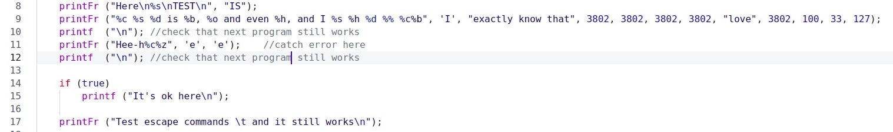

# printFr

**printFr** --- my own ```printf``` function implementation using ```nasm```.

## Project implementation
The source file is ```printFrolov.s```

Here's some interesting moments. 

The first that I've implemented wrapper for a ```syscall``` calling convention which produce it into ```cdecl```.

```assembly
    pop r14                                 ; ret adress

    push r9
    push r8
    push rcx
    push rdx
    push rsi        
    push rdi

    mov rsi, rdi

    mov r10, rsp
    add r10, 8
```

The second interesting solution is jump table usage. It's really faster than usual set of comparisons.

```assembly
    xor rax, rax
    mov al, [rsi]

    xor rbx, rbx

    mov rbx, [branchTable + rax * 8]

    jmp rbx
```

Here's an input:
<p align = "center">

</p>

And result:
<p align = "center">

</p>

## Usage note

My function supports formats

| Symbol  | Note                |
|:-------:|:-------------------:|
|%c       |print character      |
|%d       |print decimal        |
|%b       |print binary num     |
|%o       |print octal num      |
|%x       |print hex num        |
